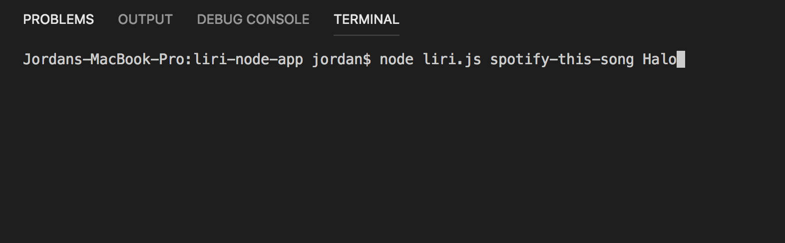
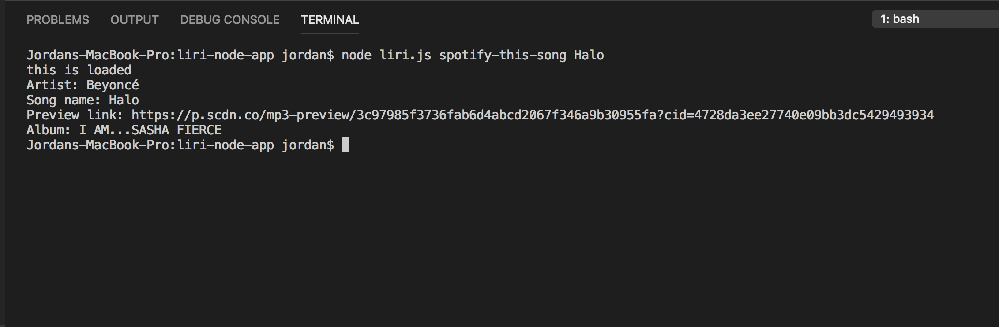
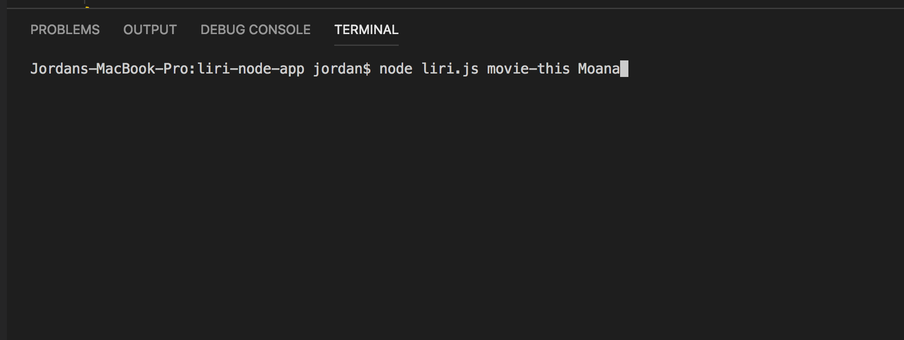
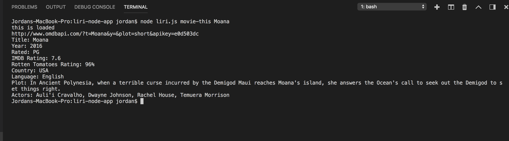
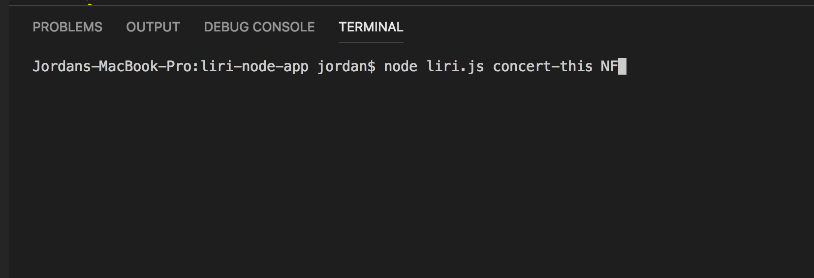
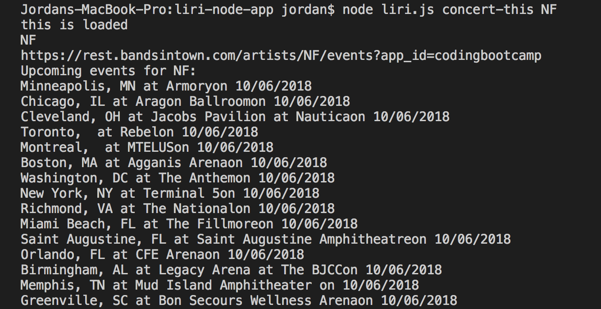
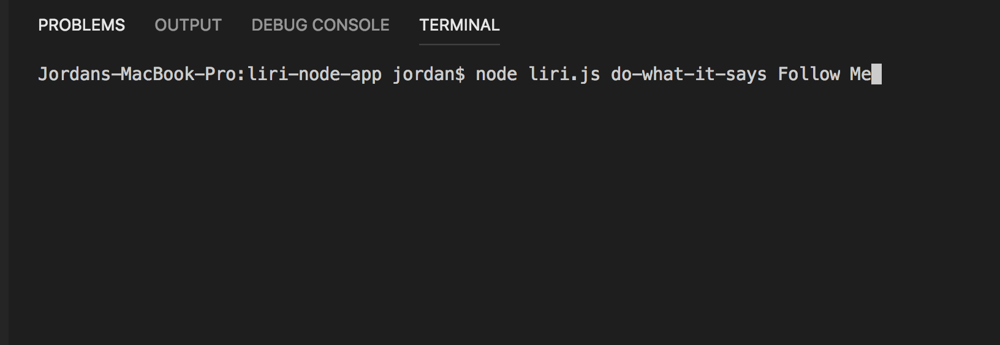
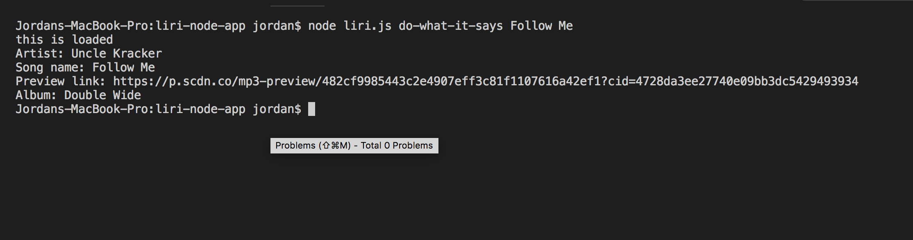
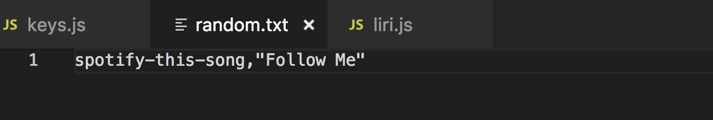

# liri-node-app

### **1. What is LIRI?**

Liri is a *Language Interpretation and Recognition Interface*. This application takes in what the request from the command line and then gives back data. This application allows searches for:

1. songs from spotify
2. movies 
3. concert dates and location based on the artist or band

### **2. How to use LIRI**

1. Search for a song:

example: node liri.js spotify-this-song halo

This gives you the output of: 

2. Search for movie:

example: node liri.js movie-this moana

This gives you the output of: 

3. Search for bands

example: node liri.js concert-this NF

This gives you the output of:

 

4. Do what it says:

example: node liri.js do-what-it-says happy

 This gives you the output of: 

This gives you that information using that command line, because in a separate file, we have it created it a in separate file:

   
   

